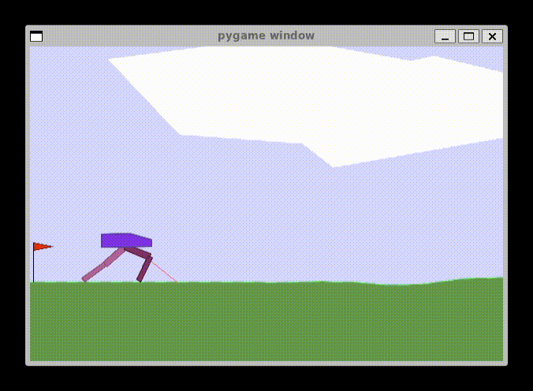

## 밴딧 문제

### 01-simple-policy: 멀티암드 밴딧 문제

state 없음, action이 4가지, non-deterministic

state에 상관없이 action에 따라 정해진 확률로 보상을 +1 혹은 -1을 얻음

단순한 신경망에 reward * log(action_logit)으로 업데이트하며 학습시켜 해결

### 02-contextual-policy: 컨텍스트 밴딧 문제

state 3가지, action 4가지, non-deterministic

보상을 얻을 확률이 state에 따라 달라짐. 그외에는 멀티암드 밴딧 문제와 동일

신경망에 state를 one hot벡터로 넣고 나온 결과로 업데이트하며 학습시켜 해결

## Q-learning

### 03-markov-decision-process: CartPole-v1

마르코프 결정 과정을 사용하여 해결, policy는 간단한 네트워크 사용

네트워크의 결과물만큼의 분포로 action을 결정

env가 terminated된 뒤 주기적으로 업데이트하여 안정성을 높임

보상을 discount 하여 안정성을 높임

### 04-q-learning-tabulo: FrozenLake-v1

상하좌우로 움직일 수 있고 항상 원하는 방향으로 진행되는게 아니라 진행하는 방향 기준 좌우로 각 33퍼센트의 확률로 돌아가 진행할 확률이 있어서 non-deterministic한 세계이다.

Q-Table 이용. discount개념. 벨만 방정식 Q(s,a) = reward + discount * max_a' (Q(s',a')) 을 사용, lr 비율만큼만 학습하여 안정성을 높임

네트워크의 결과물의 최댓값으로 action을 결정, e-greedy방식으로 일정확률로 무작위 action 결정, decaying으로 학습함에 따라 무작위로 결정할 확률을 감소시킴, random noise를 주는 방식도 있지만 효과는 비슷하다.

### 04-q-learning-tabulo-no-slippery: FrozenLake-v1, is_slippery=False

미끄러질 확률이 없어서 항상 진행하고자 하는 방향으로만 움직인다. deterministic. 그래서 같은 방법을 쓰더라도 수렴이 잘되고 성능도 좋게 나옴

Q-learning-tabulo에서 deterministic인 경우 단순히 벨만 방정식만 적용해도 항상 수렴함이 보장됨. 단 non-deterministic인 경우 lr비율만큼 천천히 학습해야 진동하지 않고 수렴함이 보장됨.

### 04-q-learning-tabulo-experiments: FrozenLake-v1

다양한 exploit&exploration 기법(e-greedy, random noise)에 쓰이는 하이퍼파라미터와 lr을 튜닝하기 위해 ray를 활용

매번 균일한 결과가 나오지 않아 수렴하지 않는다.

### 05-q-learning-network: FrozenLake-v1

Q-Table대신 Q-network를 사용. Q-Network는 항상 Q-Table보다 저조한 성능을 보이지만 Discrete하지 않는 state에 대해 적용할 수 있다는 장점이 있어서 더 다양한 환경에서 사용할 수 있음

terminated된 상황에서는 next state에서의 Q값을 0으로 가정해야 잘 학습이 됨. 그러지 않을 경우 전혀 학습이 안 됨.

### 05-q-learning-network-cartpole: CartPole-v1

Q-network의 state가 continuous한 상황에서 사용할 수 있다는 장점을 살려 CartPole에 적용

너무 단순하게 bias없는 Linear Layer하나의 역할을 하는 한 번의 행렬곱으로만 신경망을 구성해서인지 수렴을 안 함

### 06-dqn2013: CartPole-v1

dqn의 3가지 조건인 1. 심층 합성곱 네트워크 사용, 2. 경험 리플레이, 3. 타겟 네트워크 분리 중 1, 2만 적용한 2013년 버전의 dqn이다.

심층 네트워크는 화면 그대로 정보를 입력받아 계산하는 policy를 학습시킬 때 정보를 축약하기 위한 합성곱 레이어를 깊게 쌓은 것을 말한다.

경험 리플레이는 action을 함에 따라 observation이 미세하게 조금씩 바뀌기 때문에 몇 가지 비슷한 observation만으로 학습시키면 제대로 학습이 힘드므로 Transition을 모두 저장해놓고 무작위로 뽑아서 미니배치로 학습시켜 안정적으로 학습할 수 있게 한다.

타겟 네트워크 분리는 기존의 학습시키던 네트워크를 메인 네트워크와 타겟 네트워크로 분리하고, 메인 네트워크는 매 순간순간 학습되게 하고 타겟 네트워크는 주기적으로 느리게 하거나 별개의 학습률 tau를 두어 점진적으로 학습되게 하면서, 메인 네트워크를 업데이트 할 때 next_state의 Q값을 참조할 때는 타겟 네트워크를 사용하여 안정적인 업데이트가 이뤄질 수 있게 한다.

mainQ(s, a) = reward + discount * max_a' targetQ(s', a')

### 06-dqn2015: CartPole-v1

dqn의 3가지 조건을 모두 만족한 2015년 버전의 dqn이다.

### 06-dqn2015: CartPole-v2

CartPole-v2는 custom environment이고 cartpole_v2.py에 구현되어있다.

카트가 양옆으로 치우칠수록 reward를 적게 주어서, 카트가 중심으로 가도록 유도한 버전이다. 또한 reset을 했을 때 카트의 위치가 항상 중심에 있지 않고 +-1.0 지점에 있어서 스스로 카트가 중심으로 이동할 수 있게 학습되어야 한다.

### 07-ddqn: CartPole-v1

ddqn을 적용시킨 예시이다. dqn에서 업데이트 식만 아래와 같이 수정하면 된다.

mainQ(s, a) = reward + discount * targetQ(s', argmax_a' mainQ(s', a'))

타겟 네트워크의 최대 Q값으로 업데이트 하지 않고 메인 네트워크의 action대로 행동했을 때의 Q값으로 업데이트 한다.

### 07-ddqn-side-panelty: CartPole-v2

CartPole-v2에 ddqn을 적용시킨 예시이다. dqn보다 안정적으로 매우 학습이 잘 되었다. reset될 때마다 중심에서 멀리 떨어져있으면 일부러 빠르게 pole을 기울여 중심으로 움직이고 최대한 꼿꼿하게 버티는 모습을 볼 수 있다.

### 07-ddqn-bipedal: BipedalWalker-v3

CartPole-v2가 너무 학습이 잘 되어서 좀 더 어려운 환경인 BipedalWalker를 학습시켜보고자 하였다.

Q-learning은 원래 observation space와 action space가 모두 discrete할 때만 사용할 수 있다. 하지만 Q-table을 사용하는 대신 Q-network를 써서, 꼭 모든 state를 탐색하지 않아도 근사해서 action을 구해낼 수 있다. 다시 말해 Q-network를 쓰면 continuous한 observation space 환경에서도 학습할 수 있다. 하지만 action space까지 continuous인 경우에는 DDPG, A3C, C-DQN 같은 다른 기법을 사용해야 한다.

하지만 모든 continuous한 데이터는 양자화하여 일부 정보의 손실을 감수하고 discrete한 데이터로 바꿀 수 있다. BipedalWalker는 observation space, action space가 모두 continuous한 환경인데, observation space는 Q-network를 사용하는 것으로 해결하고 action space는 양자화하여 discrete문제로 바꾸어 해결해보았다.

action이 [-1, 1]범위의 수가 (4,) shape만큼 있는 continuous space라서 이를 -0.5, 0.5로 양자화하여 총 4개의 변수의 조합을 통해 2**4 = 16개의 action인 discrete문제로 접근하였다. 하지만 쓰러지지만 않을 뿐 앞으로 나아가지는 않는 저조한 성적을 보였다.

### 08-dueling-ddqn-bipedal: BipedalWalker-v3

ddqn의 다음 세대인 dueling ddqn을 적용해서 잘 안풀리던 문제를 해결해보고자 하였다.

dueling ddqn은 ddqn 마지막 부분의 구조를 약간 추가/변형시킨 것이다. 기존 네트워크는 출력값이 Q(s,a)를 의미했다면 dueling ddqn은 기존의 네트워크로 출력된 값으로 V(s), A(s,a)를 각각 구한 뒤 조합하여 Q(s,a)를 구한다. V (value function)은 특정 state s에서 그 상태가 얼마나 좋은 상태인지를 나타낸다. A (advantage function)은 state s에서 취할 수 있는 action a 중에서 특정한 action a가 얼마나 좋은 행동인지를 나타낸다. Q(s,a) = V(s) + A(s,a)로 나타낼 수 있다. Q(s,a)를 V와 A로 분리한 이유는 특정 환경에서 아무런 행동을 취하지 않아도, 혹은 어떤 행동을 취하든 상관없는 경우, 예를 들어 enduro atari 게임에서 도로에 깔린 장애물이 하나도 없는 경우, state가 좋아서 Q가 높은 값인 것인지, action이 좋아서 Q가 높은 값인 건지를 구분하여 학습한다. dueling구조는 다른 알고리즘에도 네트워크 마지막에 분리하는 구조를 넣어 적용할 수 있다.

dueling 구조의 장점은 아래가 있다.

1. 기존에는 한 번 학습할 때마다 특정 state와 action에 대해 따로따로 업데이트가 되었다면 dueling ddqn에서는 특정 state가 좋은 상황에서 state를 학습하고 action은 거의 바뀌지 않는 등의 학습이 이뤄져서 더 효율적이다.
2. 실제로 action에 의한 Q값의 차이가 크지 않고, state에 의해 Q값이 커졌다면 특정 state에서 어떤 행동을 할지 결정하기 위한 과정에서 약간의 노이즈만 있으면 올바른 행동을 결정하지 못할 수 있지만 action을 분리해서 평가하면 노이즈에 강건해진다.

실제로 구현할 땐 V(s) + A(s,a) - mean(A(s,a))로 구한다. 특정 state에서 할 수 있는 action들 가운데 가장 좋은 action을 가리기 위해 action의 평균을 빼는 것이다.

### 08-dueling-ddqn-side-panelty: CartPole-v2

dueling ddqn으로 BipedalWalker-v3에서 의미있는 성적을 거두지 않았기에 CartPole-v2에서도 실험해보았다. 수렴이 더 빨라지기는 했다.